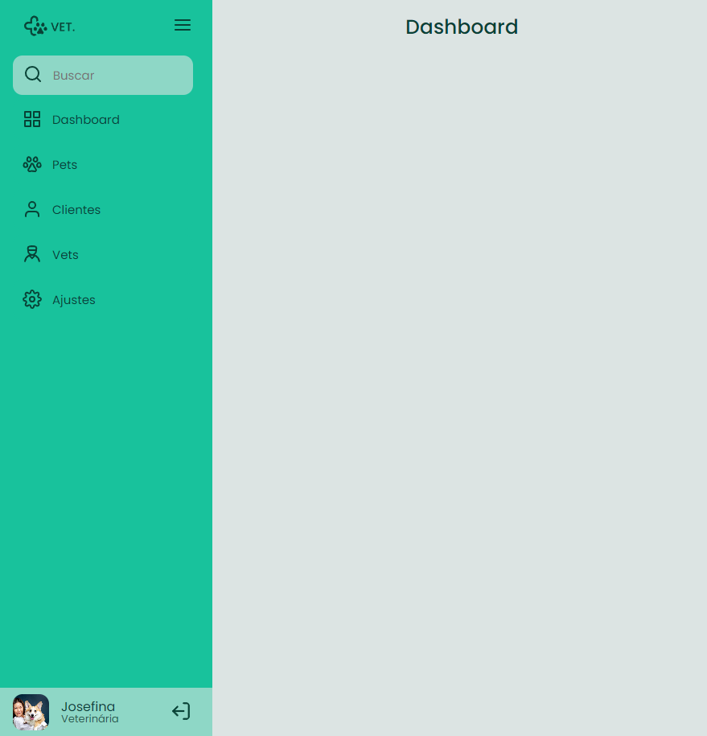
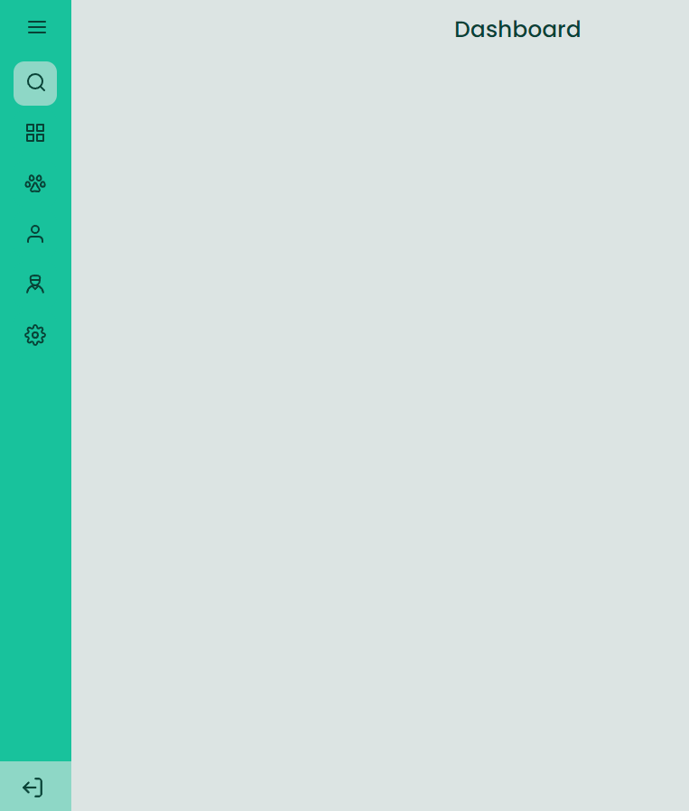

<h1 align="center"> Sidebar </h1>

O projeto consiste em uma "sidebar" como na imagem abaixo. Quando o usuário clica no ícone do menu, o estado da sidebar muda entre "aberto", mostrando ícones e texto e "fechado", mostrando apenas os ícones.

Aberta
  
  

  

Fechada 

## 🚀 Tecnologias

Esse projeto foi desenvolvido com as seguintes tecnologias:

- HTML
- CSS
- Javascript

## 💻 Projeto

- [Acesse o projeto finalizado, online](https://matheusbalbe.github.io/sidebar)

---

Feito por [Matheus Balbe](https://www.linkedin.com/in/matheusbalbe)
 
Projeto baseado no desafio da [RocketSeat]
